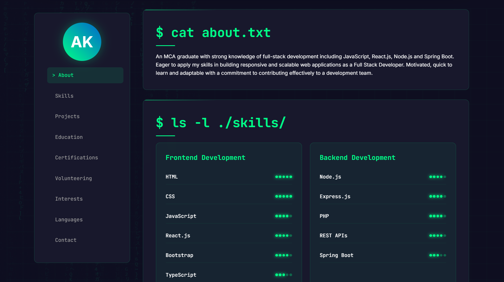

# Adarsh K - Portfolio Website



A modern, terminal-themed portfolio website showcasing my skills, projects, and experience as a Full Stack Developer.

## Features

- 🖥️ Terminal-inspired UI with matrix rain animation
- 📱 Fully responsive design
- 🛠️ Skills section with visual proficiency indicators
- 🏆 Projects showcase with technology tags
- 📚 Education timeline
- 📜 Certifications
- 🌐 Multi-language support (Hindi, English, Tamil, Telugu, Kannada, Malayalam)

## Technologies Used

- HTML5
- CSS3
- JavaScript
- Git/GitHub


## Installation (for local development)

1. Clone the repository:
```bash
git clone https://github.com/adarshk0070/portfolio-html-css.git